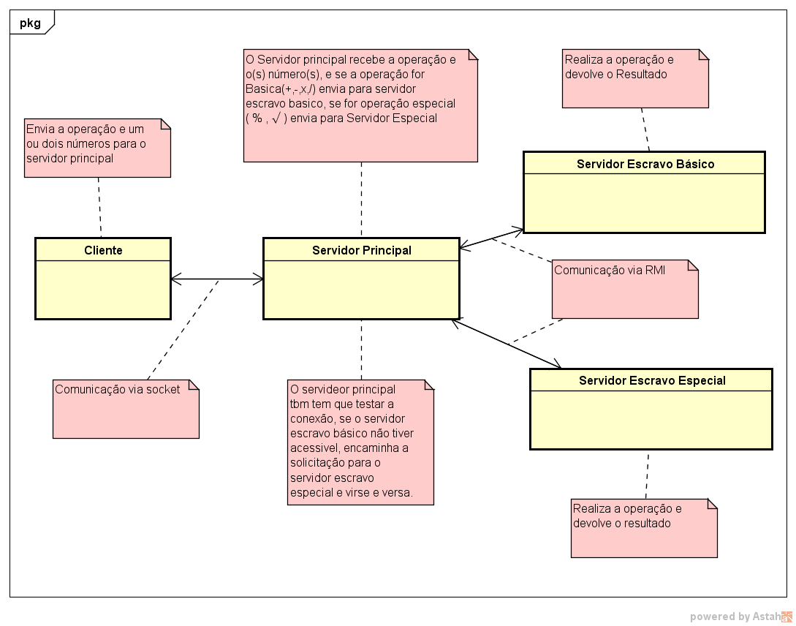

# Calculadora Socket-RMI 

### Objetivo
* Este Projeto tem a finalidade de compor a nota da disciplina 'Sistemas Distribuídos'

#### Funcionalidades :

| Feature                                                                                                                        | Status |
|--------------------------------------------------------------------------------------------------------------------------------|--------|
|um servidor concorrente principal que receberá requisições via socket e encaminhará as mesmas, via RMI para servidores escravos |  ok    |
|servidores escravos que se registrarão no servidor principal e serão encarregados de realizar as operações                      |        |
|algoritimo para decisão para escolha do servidor escravo (sugestão round-robin)                                                 |        |
|servidores escravos especializados que receberão requisições específicas, delegadas pelos servidor principal                    |        |
|clientes que farão requisições para o servidor principal                                                                        |  ok    |
|As 4 operações básicas devem ser executadas nos servidores escravos básicos                                                     |        |
|As operações de Porcentagem, raiz quadrada devem ser executadas nos servidores escravos especiais                               |        |
 
  

    

 
 
